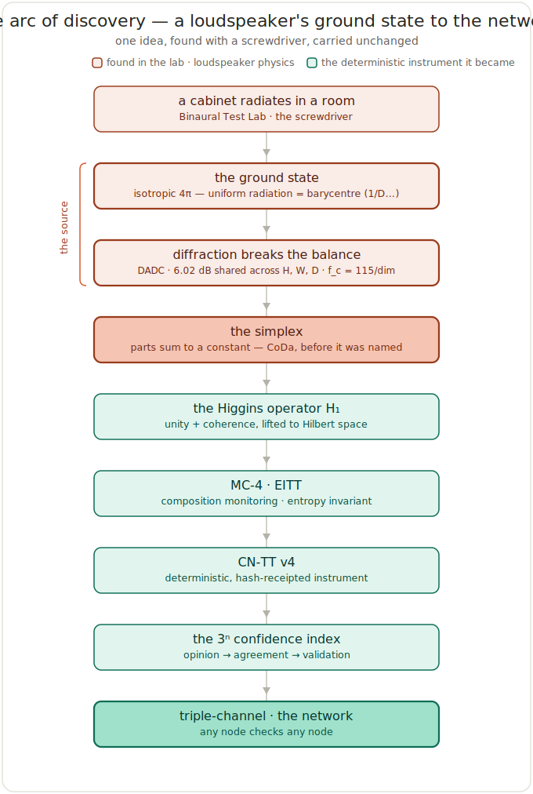

# The arc of discovery — executive summary

*The living history of one deterministic instrument, told as the nine steps that produced it. Author: Peter Higgins (human authorship for all claims); AI-assisted per HUF-STD-001. Honest-broker; claim tiers marked. This file is identical across the repositories of this system — each carries the map of the whole. Origin end: RWA `THE_GROUND_STATE.md`. Far end: the verification network in the Hˢ repo. Cross-repo resolver: `CROSS_BRAIN.md`.*

---

## How to read this

The diagram above is the spine of the whole project, and this document walks it one box at a time. For each step you get four things — **what** it is, **why** it happened, **when**, and **how** — so the history teaches itself. Nothing in the chain was invented at a whiteboard; each step was *forced* by the one before it. The logical progression at the end states that forcing explicitly.

Two colours: the warm boxes were found in the loudspeaker lab (physics); the cool boxes are the deterministic instrument that physics became. The single pivot — the simplex — is where an engineering object turned out to already be a mathematical one.

---

## 1 · A cabinet radiates in a room

**What.** The Binaural Test Lab (BTL): a sound-controlled laboratory built for loudspeaker measurement and closed-loop validation. A rectangular cabinet radiates into a room, and the room's geometry is the first boundary condition every measurement has to account for.

**Why.** Precision loudspeaker work needs an instrument built *because the measurement required it* — the building itself is the first measurement. This is the bench on which everything else was discovered, with a screwdriver.

**When.** The BTL network across Markham (research), Ottawa and Monaco (institutional); lab certification through early 2025.

**How.** Empirical measurement under controlled conditions, where the radiation pattern of a real box in a real room is the object of study. *(Tier 1 — measured.)*

## 2 · The ground state

**What.** At low frequencies the cabinet radiates **isotropically** — full 4π steradian, energy shared equally in every direction. That uniform pattern is the acoustic ground state, and it is, coordinate for coordinate, the **barycentre of the simplex** `(1/D, 1/D, …, 1/D)`: the maximum-entropy composition, the reference state every later departure is measured against.

**Why.** A system needs a resting point where the information is zero before you can measure motion away from it. The ground state is that zero.

**When.** Inherent in the physics; recognised as the framework's foundation and later written up as the unified ground-state formula.

**How.** Low-frequency radiation is omnidirectional by the physics of a body small compared to the wavelength — the uniform share is not chosen, it is forced. *(Tier 1 — derived and measured.)*

## 3 · Diffraction breaks the balance

**What.** As frequency rises and the wavelength approaches the cabinet's size, the pattern breaks — sound concentrates forward, the sides and back lose power. The correction for this is a **fixed budget**, exactly `6.02 dB = 20·log₁₀2` (the 2π→4π step), **apportioned** across the dimensions, `G_dim = 6.02·dim/S` with `S = H+W+D`, the shares always summing back to 6.02, each with corner `f_c = 115/dim`. This is **DADC** — Dimension-Apportioned Diffraction Correction (with its inverse DADI and adaptive ADAC).

**Why.** Transfer-function linearity in a 4π system demands that the diffraction budget be distributed correctly across the physical dimensions. The departure from uniform is where all the structural information lives.

**When.** Formal DADC paper, 5 December 2024.

**How.** Derived from the Rayleigh-Sommerfeld / Helmholtz boundary problem — the frequency where structure appears is set by the ratio of wavelength to dimension, not by any free parameter. This is where **time enters through physics, not as a tacked-on integral**. *(Tier 1 — derived, measured, arithmetic verified: gains 3.215 / 1.479 / 1.326 sum to 6.0206.)*

## 4 · The simplex *(the pivot)*

**What.** A conserved budget apportioned across parts that sum to a constant **is a composition on the simplex**. The DADC gain vector normalized by 6.02 is a point in the 2-simplex; the apportionment is the *shape*, the corner frequencies the *scale*. Closure — parts summing to a constant — is the defining property of compositional data.

**Why.** The recognition that this is *not a loudspeaker problem*: any conserved budget across parts has the same structure — an energy grid's seven or nine carriers, a portfolio's hundreds, a wetland's dozens. The mathematics is identical regardless of dimension or domain.

**When.** The generalization became visible in November 2025, working through the dimensional-inversion loop.

**How.** By abstraction from the acoustic case — the loudspeaker had been doing compositional data analysis before CoDa had named it. *(Tier 2 — standard math soundly applied.)*

## 5 · The Higgins operator H₁

**What.** H₁ states the principle operator-theoretically: unity-normalization plus directional-coherence preservation, lifted to abstract Hilbert space. "Parts sum to a constant, directional information is preserved, the measurement is inert" becomes a single operator.

**Why.** To make the structure domain-independent — to say it once, abstractly, so it applies anywhere a system has many components summing to something preserved under an operation.

**When.** The Higgins Operator H₁ paper, February 2026.

**How.** Generalization from the concrete acoustic map to a nonlinear unity-normalization map on Hilbert space; candidate applications span cosmology, urban resilience, EUV lithography, Planck CMB anomalies, and stellar fusion. *(Tier 2.)*

## 6 · MC-4 · EITT

**What.** Contact with the Compositional Data Analysis community supplied names for what the physics had already built (simplex, Aitchison geometry, log-ratio transforms, Fréchet mean, subcompositional coherence). **MC-4** names composition monitoring as a fourth category alongside magnitude, identity, and trend. **EITT** (Entropy-Invariant Time Transformer) is the temporal face of DADC's spatial decimation: Shannon entropy of a compositional time series stays near-invariant under geometric-mean decimation — measured at 0.18% over a 341:1 reduction.

**Why.** The temporal counterpart completes the picture: the timescale is intrinsic to the composition, so coarse-graining time does not destroy its structure — the same truth DADC states in frequency.

**When.** April 2026.

**How.** By bringing the CoDa vocabulary into contact with the framework and validating EITT across energy, chemistry (500k points), hardware reliability, climate, and geochemistry (40,666 igneous rocks). *(Tier 1 for the measured invariance; the proof from Aitchison geometry is an open question — Tier 3.)*

## 7 · CN-TT v4

**What.** The deterministic, hash-receipted instrument: closure → CLR → tiling → diagnostics → hash. It identifies a 4-part composition with an exact unit quaternion and tiles that exactness to any dimension — lossless reconstruction proven to D = 1,000,000 — with a frozen validation oracle behind it.

**Why.** To turn MC-4 / EITT into a reproducible *instrument*: same input, same output, same receipt, on any machine.

**When.** Matured through 2026 into the current engine (post-CoDaWork 2026).

**How.** By engineering the math into a hash-chained pipeline with a determinism contract and self-diagnostics; certified to reproduce the frozen oracle bit-for-bit on real data. *(Tier 1 — implemented and verified.)*

## 8 · The 3ⁿ confidence index

**What.** A confidence ladder for whole systems: **n=1 opinion** (3 independent checks), **n=2 agreement** (9), **n=3 validation** (27, where the odd one out can be *located*, not merely detected), scaling to certification and standard. `C_n = 1 − (1−p)^(3ⁿ)`.

**Why.** There was no standard way to express confidence in the validity of a large system of systems. The paired-measurement instinct from the lab — *one curve lies; always read two* — scaled to a general ladder.

**When.** 5 April 2026.

**How.** From the geometry of independent perspectives: one is a point, two a line, three a plane — three is the minimum dimensionality for triangulation, the minimum to locate an error. *(Tier 2 — a working framework, honest about its own confidence level.)*

## 9 · Triple-channel · the network

**What.** The operational realization of the 3ⁿ index. A single box runs three independent readers (tiling + Clifford + matrix) under a 2-of-3 vote — consensus `RC-CON-INF`, isolate the outlier `RC-ISO-WRN`, halt-and-report `RC-HLT-ERR`. Generalized to a network, any node checks any other by recomputing its read and comparing the hash receipt: determinism is the cross-verify primitive.

**Why.** Redundancy you can trust without trust — reproduction is the proof. The geo probe on the wall becomes a backup channel for the gas mask in the infirmary, because both are just compositions to the instrument.

**When.** Built and verified 11 June 2026.

**How.** By making every read deterministic and hash-receipted, so the same composition yields the same content hash on any node anywhere. *(Tier 1 for the primitive and the vote; a deployed cross-domain mesh is Tier 3 — to earn.)*

---

## The logical progression

Read the nine steps as a single forced chain, each link a consequence of the one before:

> A finite body radiating into a room **has** a uniform ground state (2), because low-frequency radiation is isotropic by physics. That ground state **must** break as wavelength meets dimension (3), and the only correct way to break a conserved budget is to apportion it across parts — which **is** a composition on the simplex (4). A composition on the simplex **is** an instance of one operator (5), which **is** what composition monitoring measures (6), which **becomes** trustworthy only as a deterministic, hash-receipted instrument (7). An instrument that issues receipts **invites** a confidence ladder built on independent agreement (8), and a confidence ladder built on reproduction **is** a verification network where any node checks any node (9).

Nothing was added from outside. The conserved budget forced the simplex; the simplex forced the operator; the operator forced the monitoring; the monitoring forced the instrument; the instrument forced the confidence model; the confidence model forced the network. And the network closes the loop back on the instrument itself — the thing built to read compositions reads the composition of its own readers.

That is why the framework can claim certainty: not faith that it applies everywhere, but certainty in an instrument whose every part is a consequence rather than a choice, plus the honesty to let it report where it fits. The box gave the formula. The open loop is what lets it be trusted everywhere it is earned.

---

## Where to read next

- **The headwater, in full:** RWA repo `THE_GROUND_STATE.md` — the one formula and the time argument, derived.
- **The far end, built:** Hˢ repo `experiments/clifford_tiling_redundancy_2026-06/` and `experiments/network_redundancy_2026-06/`.
- **The confidence model:** HUF repo `science/methodology/CONFIDENCE_INDEX.md`.
- **The two-repo map + resolver:** `CROSS_BRAIN.md` (identical in both repos).
- **The narrative lineage:** HUF `briefings/THE_LINEAGE.md`; RWA `LINEAGE.md` and `HUF_RELATIONSHIP.json`.
